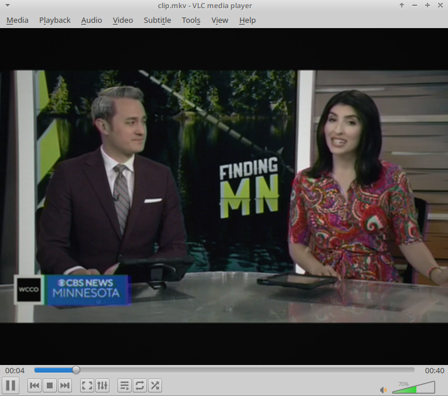

# Electron 51TC-433D / 51TC-451D Signal Emulator

A POSIX shell script (`convert.sh`) utilizing `ffmpeg` and `ffprobe` to re-encode video into a deterministic simulation of Soviet Electron (Электрон) 51TC-433D and 51TC-451D television sets.

## Hardware Specifications: Electron 51TC-433D / 451D

The Electron 51TC-433D / 51TC-451D is a 4th-generation Soviet color CRT television set (4USTCT-51 chassis series) produced in Lviv by PO Electron in the late 1980s and early 1990s.

* **Display Tube**: 51LK2B shadow-mask CRT (51 cm diagonal, 90° deflection angle).
* **Color Decoder**: MCR-402 PAL/SECAM matrix unit using K174AF series ICs.
* **Audio Stage**: K174UN7 power amplifier integrated circuit driving an internal 2GD-40 (or 3GDSH-1) dynamic cone speaker.
* **Acoustics**: Single mono channel, enclosed in a wooden multi-layer cabinet with plastic front fascia.

## Simulation Pipeline Architecture

The script passes audio and video streams through specific DSP and filter parameters to recreate hardware limitations.

### Video Filter Chain

| Target Hardware Parameter | Signal Transformation | FFmpeg Filter |
| --- | --- | --- |
| **Aspect & Resolution** | Rescales image to 4:3 display aspect ratio at 576 lines | `scale=768:576:force_original_aspect_ratio=decrease`, `pad=768:576` |
| **RF Voltage Fluctuations** | Introduces moderate temporal signal variance across frame channels | `noise=alls=10:allf=t+u` |
| **Chroma Displacement** | Simulates SECAM subcarrier delay and registration shift | `chromashift=cbh=3:crh=-2:cbv=1:crv=0` |
| **Electron Spot Diffusion** | Recreates cathode ray defocusing across phosphor dots | `boxblur=1.0:1:0:0` |
| **Phosphor Response & Contrast** | Modifies gamma and contrast to represent CRT transfer | `eq=saturation=0.90:brightness=-0.004:contrast=1.06:gamma=1.04` |
| **Scanline Raster** | Generates 50Hz interlaced grid structure | `drawgrid=w=768:h=2:c=black@0.13:t=1` |
| **Luminance Transfer Curve** | Maps signal level to nonlinear glass phosphor output | `curves=m='0/0.04 0.5/0.48 1/0.95'` |
| **Glass Curvature** | Models spherical tube geometry light falloff | `vignette=angle=PI/6.8` |

### Audio Filter Chain

* **Mono Downmixing**: Downmixes all streams to single-channel format (`aformat=channel_layouts=mono`).
* **Bandwidth Limitation**:
* High-pass filter at **140 Hz** (`highpass=f=140`) matching lower driver physics.
* Low-pass filter at **9000 Hz** (`lowpass=f=9000`) enforcing mechanical voice coil roll-off.
* **Acoustic Resonances**:
* **2.8 kHz Peak** (`equalizer=f=2800:width_type=h:width=200:g=3.5`): Recreates 2GD-40 cone driver resonance peak.
* **380 Hz Peak** (`equalizer=f=380:width_type=h:width=100:g=2`): Models internal cabinet cavity resonance.
* **Static Signal Mixing**: Generates baseline static background via `anoisesrc` at 12% weight (`amix=inputs=2:weights=1 0.12`).

## Usage Instructions

1. Place `convert.sh` in the directory containing target media (`.avi`, `.mp4`, `.mkv`, `.webm`).
2. Grant execution permissions: `chmod +x convert.sh`
3. Run the processing pipeline: `./convert.sh`
4. Output videos accumulate in `./out/`