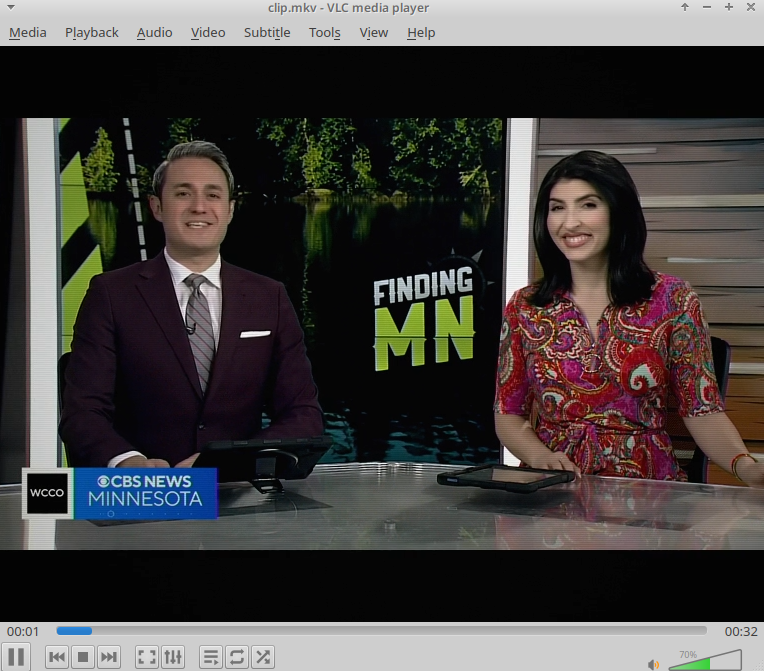

# Funai TV-2000MK7 Signal Emulator

A POSIX shell script (`convert.sh`) utilizing `ffmpeg` and `ffprobe` to re-encode video into a deterministic simulation of Japanese Funai TV-2000MK7 television sets.

## Hardware Specifications: Funai TV-2000MK7

The Funai TV-2000MK7 is a 20-inch mass-market color CRT television set based on the Funai MK7 chassis produced throughout the 1990s.

* **Display Tube**: 20-inch (51 cm diagonal) spherical shadow-mask CRT (90° deflection angle).
* **Color Decoder**: Single-chip integrated circuit PAL/SECAM/NTSC video processing processor.
* **Audio Stage**: Monolithic integrated audio power amplifier driving a single internal 8-ohm dynamic full-range speaker.
* **Acoustics**: Single mono channel, enclosed in an injection-molded plastic cabinet.

## Simulation Pipeline Architecture

The script passes audio and video streams through specific DSP and filter parameters to recreate hardware limitations.

### Video Filter Chain

| Target Hardware Parameter | Signal Transformation | FFmpeg Filter |
| --- | --- | --- |
| **Aspect & Resolution** | Rescales image to 4:3 display aspect ratio at 576 lines | `scale=768:576:force_original_aspect_ratio=decrease`, `pad=768:576` |
| **RF Voltage Fluctuations** | Introduces minimal temporal signal variance consistent with IC RF front-ends | `noise=alls=5:allf=t+u` |
| **Chroma Displacement** | Models IC-stabilized subcarrier alignment with tight horizontal registration | `chromashift=cbh=1:crh=-1:cbv=0:crv=0` |
| **Electron Spot Diffusion** | Models sharp electron gun focusing and high dot-pitch resolution | `boxblur=0.5:1:0:0` |
| **Phosphor Response & Contrast** | Enhances color saturation and contrast typical of 1990s Japanese CRTs | `eq=saturation=1.02:brightness=-0.001:contrast=1.12:gamma=1.00` |
| **Scanline Raster** | Generates faint 50Hz raster line structure | `drawgrid=w=768:h=2:c=black@0.10:t=1` |
| **Luminance Transfer Curve** | Maps signal level to dynamic high-contrast glass phosphor response | `curves=m='0/0.02 0.5/0.50 1/0.98'` |
| **Glass Curvature** | Models mild spherical glass curvature light falloff | `vignette=angle=PI/7.5` |

### Audio Filter Chain

* **Mono Downmixing**: Downmixes all streams to single-channel format (`aformat=channel_layouts=mono`).
* **Bandwidth Limitation**:
* High-pass filter at **100 Hz** (`highpass=f=100`) matching small driver limits.
* Low-pass filter at **12500 Hz** (`lowpass=f=12500`) enforcing IC amplifier roll-off.
* **Acoustic Resonances**:
* **3.2 kHz Peak** (`equalizer=f=3200:width_type=h:width=300:g=2.5`): Recreates plastic baffle driver resonance.
* **350 Hz Peak** (`equalizer=f=350:width_type=h:width=120:g=1`): Models lightweight plastic cabinet cavity resonance.
* **Static Signal Mixing**: Generates baseline static background via `anoisesrc` at 5% weight (`amix=inputs=2:weights=1 0.05`).

## Usage Instructions

1. Place `convert.sh` in the directory containing target media (`.avi`, `.mp4`, `.mkv`, `.webm`).
2. Grant execution permissions: `chmod +x convert.sh`
3. Run the processing pipeline: `./convert.sh`
4. Output videos accumulate in `./out/`