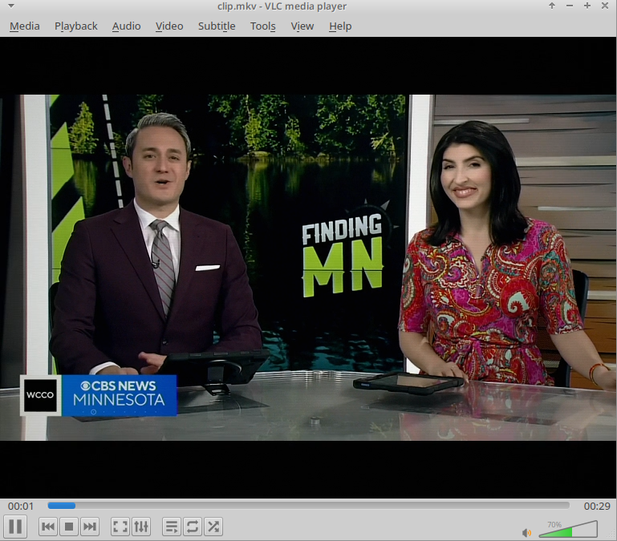

# GoldStar (LG) CK-20E40 Signal Emulator

A POSIX shell script (`convert.sh`) utilizing `ffmpeg` and `ffprobe` to re-encode video into a deterministic simulation of GoldStar (LG) CK-20E40 television sets.

## Hardware Specifications: GoldStar (LG) CK-20E40

The GoldStar CK-20E40 is a 20-inch color CRT television set based on the GoldStar/LG MC-64A chassis manufactured in South Korea and assembled across international locations throughout the mid-to-late 1990s.

* **Display Tube**: 20-inch (51 cm diagonal) dark-tinted spherical shadow-mask CRT (90° deflection angle).
* **Color Decoder**: TDA8362 single-chip integrated PAL/SECAM/NTSC video processor.
* **Audio Stage**: LA4225 or TDA2006 power amplifier integrated circuit driving an internal front-facing dynamic cone speaker.
* **Acoustics**: Single mono channel, enclosed in a molded plastic cabinet.

## Simulation Pipeline Architecture

The script passes audio and video streams through specific DSP and filter parameters to recreate hardware limitations.

### Video Filter Chain

| Target Hardware Parameter | Signal Transformation | FFmpeg Filter |
| --- | --- | --- |
| **Aspect & Resolution** | Rescales image to 4:3 display aspect ratio at 576 lines | `scale=768:576:force_original_aspect_ratio=decrease`, `pad=768:576` |
| **RF Voltage Fluctuations** | Introduces minimal temporal variance corresponding to IC tuner stages | `noise=alls=4:allf=t+u` |
| **Chroma Displacement** | Models IC subcarrier alignment with minimal horizontal offset | `chromashift=cbh=1:crh=0:cbv=0:crv=0` |
| **Electron Spot Diffusion** | Models sharp spot focusing of mid-1990s inline guns | `boxblur=0.4:1:0:0` |
| **Phosphor Response & Contrast** | Enhances saturation and contrast matching 1990s consumer CRTs | `eq=saturation=1.05:brightness=0.000:contrast=1.10:gamma=0.98` |
| **Scanline Raster** | Generates fine 50Hz raster line structure | `drawgrid=w=768:h=2:c=black@0.08:t=1` |
| **Luminance Transfer Curve** | Maps signal level to dark-tinted glass phosphor response | `curves=m='0/0.01 0.5/0.51 1/0.99'` |
| **Glass Curvature** | Models slight spherical glass falloff | `vignette=angle=PI/7.8` |

### Audio Filter Chain

* **Mono Downmixing**: Downmixes all streams to single-channel format (`aformat=channel_layouts=mono`).
* **Bandwidth Limitation**:
* High-pass filter at **90 Hz** (`highpass=f=90`) matching small driver response.
* Low-pass filter at **13000 Hz** (`lowpass=f=13000`) matching IC audio stage bandwidth.
* **Acoustic Resonances**:
* **3.1 kHz Peak** (`equalizer=f=3100:width_type=h:width=250:g=2`): Recreates plastic baffle driver resonance.
* **320 Hz Peak** (`equalizer=f=320:width_type=h:width=100:g=1`): Models cabinet internal cavity resonance.
* **Static Signal Mixing**: Generates baseline static background via `anoisesrc` at 4% weight (`amix=inputs=2:weights=1 0.04`).

## Usage Instructions

1. Place `convert.sh` in the directory containing target media (`.avi`, `.mp4`, `.mkv`, `.webm`).
2. Grant execution permissions: `chmod +x convert.sh`
3. Run the processing pipeline: `./convert.sh`
4. Output videos accumulate in `./out/`