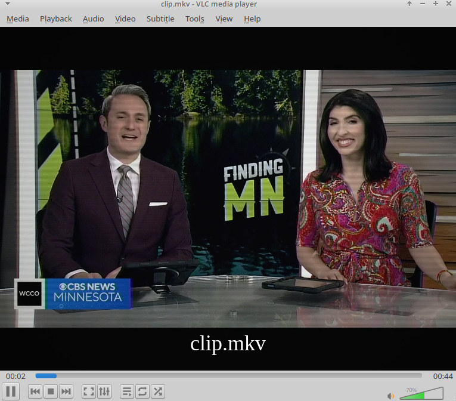

# Gorizont 51TC-412 / 51TC-510 Signal Emulator

A POSIX shell script (`convert.sh`) utilizing `ffmpeg` and `ffprobe` to re-encode video into a deterministic simulation of Soviet Gorizont (Горизонт) 51TC-412 and 51TC-510 television sets.

## Hardware Specifications: Gorizont 51TC-412 / 51TC-510

The Gorizont 51TC-412 / 51TC-510 series represents 4th and 5th-generation Soviet color CRT television sets (4USTCT and 5USTCT chassis series) produced in Minsk by PO Gorizont in the late 1980s and early 1990s.

* **Display Tube**: 51LK2B / planar 51 cm shadow-mask CRT (51 cm diagonal, 90° deflection angle).
* **Color Decoder**: MCR-403 / TDA3561A integrated circuit PAL/SECAM matrix unit.
* **Audio Stage**: K174UN14 power amplifier integrated circuit driving an internal 3GDSH-1 full-range dynamic cone speaker.
* **Acoustics**: Single mono channel, enclosed in a molded composite chassis.

## Simulation Pipeline Architecture

The script passes audio and video streams through specific DSP and filter parameters to recreate hardware limitations.

### Video Filter Chain

| Target Hardware Parameter | Signal Transformation | FFmpeg Filter |
| --- | --- | --- |
| **Aspect & Resolution** | Rescales image to 4:3 display aspect ratio at 576 lines | `scale=768:576:force_original_aspect_ratio=decrease`, `pad=768:576` |
| **RF Voltage Fluctuations** | Introduces reduced temporal signal variance across frame channels | `noise=alls=7:allf=t+u` |
| **Chroma Displacement** | Simulates IC-stabilized SECAM subcarrier delay and registration | `chromashift=cbh=2:crh=-1:cbv=0:crv=0` |
| **Electron Spot Diffusion** | Recreates tightened electron gun beam focusing across phosphor dots | `boxblur=0.7:1:0:0` |
| **Phosphor Response & Contrast** | Modifies gamma and contrast to represent active IC driver transfer | `eq=saturation=0.96:brightness=-0.002:contrast=1.10:gamma=1.02` |
| **Scanline Raster** | Generates 50Hz interlaced grid structure | `drawgrid=w=768:h=2:c=black@0.12:t=1` |
| **Luminance Transfer Curve** | Maps signal level to nonlinear glass phosphor output | `curves=m='0/0.03 0.5/0.49 1/0.96'` |
| **Glass Curvature** | Models reduced spherical tube geometry light falloff | `vignette=angle=PI/7.0` |

### Audio Filter Chain

* **Mono Downmixing**: Downmixes all streams to single-channel format (`aformat=channel_layouts=mono`).
* **Bandwidth Limitation**:
* High-pass filter at **120 Hz** (`highpass=f=120`) matching lower driver physics.
* Low-pass filter at **11500 Hz** (`lowpass=f=11500`) enforcing extended transducer roll-off.
* **Acoustic Resonances**:
* **3.0 kHz Peak** (`equalizer=f=3000:width_type=h:width=250:g=3`): Recreates 3GDSH-1 cone driver resonance peak.
* **350 Hz Peak** (`equalizer=f=350:width_type=h:width=120:g=1.5`): Models internal cabinet cavity resonance.
* **Static Signal Mixing**: Generates baseline static background via `anoisesrc` at 8% weight (`amix=inputs=2:weights=1 0.08`).

## Usage Instructions

1. Place `convert.sh` in the directory containing target media (`.avi`, `.mp4`, `.mkv`, `.webm`).
2. Grant execution permissions: `chmod +x convert.sh`
3. Run the processing pipeline: `./convert.sh`
4. Output videos accumulate in `./out/`