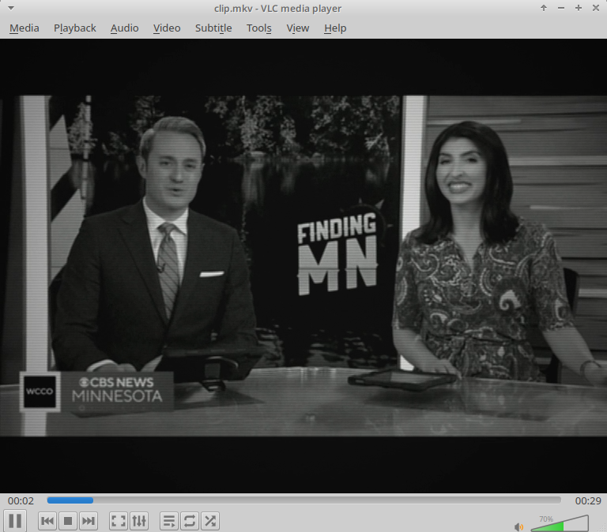

# Junost 402B Signal Emulator

A POSIX shell script (`convert.sh`) utilizing `ffmpeg` and `ffprobe` to re-encode video into a deterministic simulation of Soviet Junost (Юность) 402B portable television sets.

## Hardware Specifications: Junost 402B

The Junost 402B is a portable Soviet monochrome CRT television set produced in Moscow by the Radio Plant named after A.S. Popov starting in the late 1970s and throughout the 1980s.

* **Display Tube**: 31LK4B monochrome CRT (31 cm diagonal, 90° deflection angle).
* **Color Decoder**: None (Monochrome composite video signal path, direct video frequency amplifier).
* **Audio Stage**: Discrete transistor audio power amplifier driving an internal 0.5GD-30 (or 1GD-40) dynamic speaker.
* **Acoustics**: Single mono channel enclosed in a high-impact portable plastic cabinet.

## Simulation Pipeline Architecture

The script passes audio and video streams through specific DSP and filter parameters to recreate hardware limitations.

### Video Filter Chain

| Target Hardware Parameter | Signal Transformation | FFmpeg Filter |
| --- | --- | --- |
| **Aspect & Resolution** | Rescales image to 4:3 display aspect ratio at 576 lines | `scale=768:576:force_original_aspect_ratio=decrease`, `pad=768:576` |
| **RF Voltage Fluctuations** | Introduces high signal variance associated with telescopic antennas | `noise=alls=18:allf=t+u` |
| **Monochrome Processing** | Completely strips color subcarriers to model B&W video path | `eq=saturation=0` |
| **Electron Spot Diffusion** | Recreates beam defocusing across a small monochrome tube | `boxblur=1.4:1:0:0` |
| **Phosphor Response & Contrast** | Elevates contrast and gamma to mirror P4 monochrome phosphor | `eq=brightness=-0.01:contrast=1.12:gamma=1.08` |
| **Scanline Raster** | Generates prominent 50Hz raster lines on small tube area | `drawgrid=w=768:h=2:c=black@0.18:t=1` |
| **Luminance Transfer Curve** | Maps signal level to monochrome glass phosphor transfer | `curves=m='0/0.06 0.5/0.46 1/0.92'` |
| **Glass Curvature** | Models high curvature and edge brightness falloff of 31LK4B tube | `vignette=angle=PI/5.5` |

### Audio Filter Chain

* **Mono Downmixing**: Downmixes all streams to single-channel format (`aformat=channel_layouts=mono`).
* **Bandwidth Limitation**:
* High-pass filter at **220 Hz** (`highpass=f=220`) matching compact speaker enclosure physics.
* Low-pass filter at **6800 Hz** (`lowpass=f=6800`) enforcing early acoustic driver roll-off.
* **Acoustic Resonances**:
* **1.8 kHz Peak** (`equalizer=f=1800:width_type=h:width=180:g=4`): Recreates 0.5GD-30 cone driver resonance peak.
* **450 Hz Peak** (`equalizer=f=450:width_type=h:width=100:g=2.5`): Models plastic portable chassis cavity resonance.
* **Static Signal Mixing**: Generates baseline background static via `anoisesrc` at 22% weight (`amix=inputs=2:weights=1 0.22`).

## Usage Instructions

1. Place `convert.sh` in the directory containing target media (`.avi`, `.mp4`, `.mkv`, `.webm`).
2. Grant execution permissions: `chmod +x convert.sh`
3. Run the processing pipeline: `./convert.sh`
4. Output videos accumulate in `./out/`