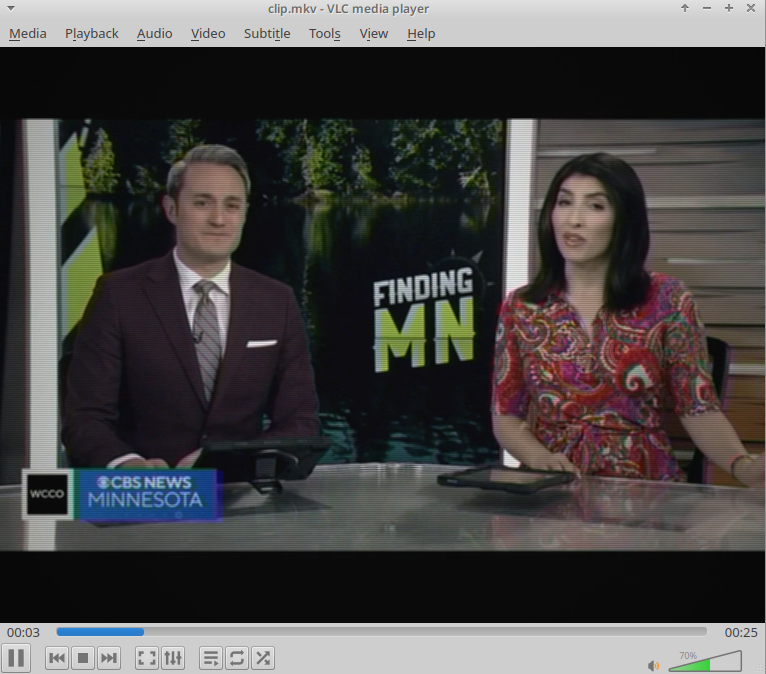

# Photon 51TC-408D Signal Emulator

A POSIX shell script (`convert.sh`) utilizing `ffmpeg` and `ffprobe` to re-encode video into a deterministic simulation of Soviet Photon (Фотон) 51TC-408D television sets.

## Hardware Specifications: Photon 51TC-408D

The Photon 51TC-408D is a 4th-generation Soviet color CRT television set (4USTCT-51 chassis series) produced in Simferopol by PO Foton in the late 1980s and early 1990s.

* **Display Tube**: 51LK2B shadow-mask CRT (51 cm diagonal, 90° deflection angle).
* **Color Decoder**: MCR-402 / MUP-402 PAL/SECAM matrix unit using K174 series ICs.
* **Audio Stage**: K174UN7 power amplifier integrated circuit driving an internal 3GD-38 (or 2GD-40) full-range dynamic cone speaker.
* **Acoustics**: Single mono channel, enclosed in a composite particleboard and plastic cabinet.

## Simulation Pipeline Architecture

The script passes audio and video streams through specific DSP and filter parameters to recreate hardware limitations.

### Video Filter Chain

| Target Hardware Parameter | Signal Transformation | FFmpeg Filter |
| --- | --- | --- |
| **Aspect & Resolution** | Rescales image to 4:3 display aspect ratio at 576 lines | `scale=768:576:force_original_aspect_ratio=decrease`, `pad=768:576` |
| **RF Voltage Fluctuations** | Introduces moderate temporal signal variance across frame channels | `noise=alls=11:allf=t+u` |
| **Chroma Displacement** | Simulates SECAM subcarrier delay and decoder misalignment | `chromashift=cbh=3:crh=-2:cbv=1:crv=-1` |
| **Electron Spot Diffusion** | Recreates cathode ray defocusing across phosphor dots | `boxblur=1.1:1:0:0` |
| **Phosphor Response & Contrast** | Modifies gamma and contrast to represent CRT phosphor response | `eq=saturation=0.91:brightness=-0.005:contrast=1.07:gamma=1.04` |
| **Scanline Raster** | Generates 50Hz interlaced grid structure | `drawgrid=w=768:h=2:c=black@0.14:t=1` |
| **Luminance Transfer Curve** | Maps signal level to nonlinear glass phosphor output | `curves=m='0/0.05 0.5/0.48 1/0.94'` |
| **Glass Curvature** | Models spherical tube geometry light falloff | `vignette=angle=PI/6.6` |

### Audio Filter Chain

* **Mono Downmixing**: Downmixes all streams to single-channel format (`aformat=channel_layouts=mono`).
* **Bandwidth Limitation**:
* High-pass filter at **145 Hz** (`highpass=f=145`) matching lower driver physics.
* Low-pass filter at **9200 Hz** (`lowpass=f=9200`) enforcing mechanical voice coil roll-off.
* **Acoustic Resonances**:
* **2.7 kHz Peak** (`equalizer=f=2700:width_type=h:width=200:g=3.8`): Recreates 3GD-38 cone driver resonance peak.
* **390 Hz Peak** (`equalizer=f=390:width_type=h:width=100:g=2`): Models internal cabinet cavity resonance.
* **Static Signal Mixing**: Generates baseline static background via `anoisesrc` at 13% weight (`amix=inputs=2:weights=1 0.13`).

## Usage Instructions

1. Place `convert.sh` in the directory containing target media (`.avi`, `.mp4`, `.mkv`, `.webm`).
2. Grant execution permissions: `chmod +x convert.sh`
3. Run the processing pipeline: `./convert.sh`
4. Output videos accumulate in `./out/`