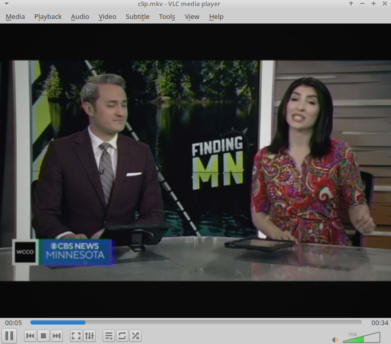

# Rubin 51TC-402D / 51TC-460D Signal Emulator

A POSIX shell script (`convert.sh`) utilizing `ffmpeg` and `ffprobe` to re-encode video into a deterministic simulation of Soviet Rubin (Рубин) 51TC-402D and 51TC-460D television sets.

## Hardware Specifications: Rubin 51TC-402D / 460D

The Rubin 51TC-402D / 51TC-460D is a 4th-generation Soviet color CRT television set (4USTCT chassis series) produced in the late 1980s and early 1990s.

* **Display Tube**: 51LK2B / 51LK1B shadow-mask CRT (51 cm diagonal, 90° deflection angle).
* **Color Decoder**: MUP-402 PAL/SECAM matrix unit.
* **Audio Stage**: K174UN7 power amplifier integrated circuit driving an internal 3GD-38 (or 2GD-40) full-range dynamic cone speaker.
* **Acoustics**: Single mono channel, enclosed in a rigid composite cabinet.

## Simulation Pipeline Architecture

The script passes audio and video streams through specific DSP and filter parameters to recreate hardware limitations.

### Video Filter Chain

| Target Hardware Parameter | Signal Transformation | FFmpeg Filter |
| --- | --- | --- |
| **Aspect & Resolution** | Rescales image to 4:3 display aspect ratio at 576 lines | `scale=768:576:force_original_aspect_ratio=decrease`, `pad=768:576` |
| **RF Voltage Fluctuations** | Introduces temporal signal variance across frame channels | `noise=alls=12:allf=t+u` |
| **Chroma Displacement** | Simulates SECAM subcarrier delay and decoder misalignment | `chromashift=cbh=4:crh=-2:cbv=1:crv=-1` |
| **Electron Spot Diffusion** | Recreates cathode ray defocusing across phosphor dots | `boxblur=1.2:1:0:0` |
| **Phosphor Response & Contrast** | Modifies gamma and elevates black level threshold | `eq=saturation=0.92:brightness=-0.005:contrast=1.08:gamma=1.05` |
| **Scanline Raster** | Generates 50Hz interlaced grid structure | `drawgrid=w=768:h=2:c=black@0.14:t=1` |
| **Luminance Transfer Curve** | Maps signal level to nonlinear glass phosphor output | `curves=m='0/0.05 0.5/0.48 1/0.94'` |
| **Glass Curvature** | Models spherical tube geometry light falloff | `vignette=angle=PI/6.5` |

### Audio Filter Chain

* **Mono Downmixing**: Downmixes all streams to single-channel format (`aformat=channel_layouts=mono`).
* **Bandwidth Limitation**:
* High-pass filter at **150 Hz** (`highpass=f=150`) matching lower driver physics.
* Low-pass filter at **9500 Hz** (`lowpass=f=9500`) enforcing mechanical voice coil roll-off.

* **Acoustic Resonances**:
* **2.5 kHz Peak** (`equalizer=f=2500:width_type=h:width=200:g=4`): Recreates cone driver resonance peak.
* **400 Hz Peak** (`equalizer=f=400:width_type=h:width=100:g=2`): Models chassis cavity resonance.

* **Static Signal Mixing**: Generates baseline static background via `anoisesrc` at 15% weight (`amix=inputs=2:weights=1 0.15`).

## Usage Instructions

1. Place `convert.sh` in the directory containing target media (`.avi`, `.mp4`, `.mkv`, `.webm`).
2. Grant execution permissions: `chmod +x convert.sh`
3. Run the processing pipeline: `./convert.sh`
4. Output videos accumulate in `./out/`