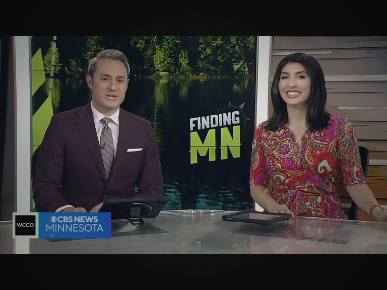
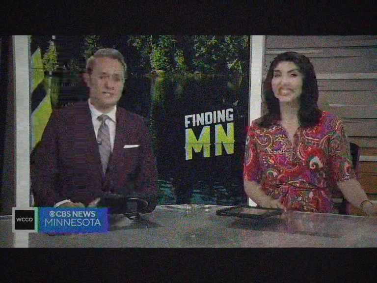
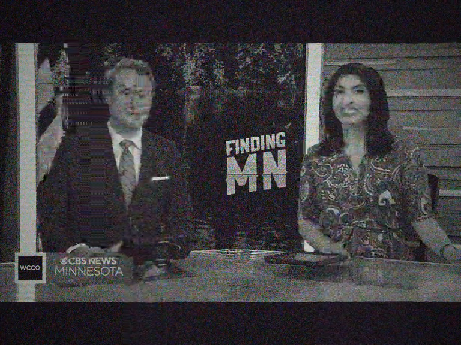

# Samsung CS-2173

Shadow-mask CRT, 21", KS1A single-chip decoder, PAL/SECAM D/K. Budget
class: lifted shadows, high saturation, deep vignette. Mono, 22050 Hz
band.

Strong:

Weak color:

Weak B/W:

