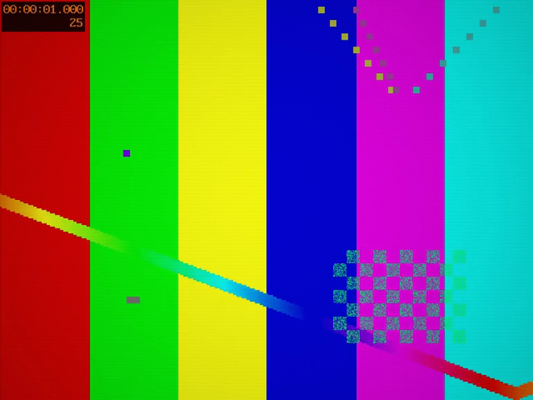

# Pressed DVD

Factory-pressed PAL disc. The MPEG-2 source maps 1:1 onto the 768x576 canvas;
a pressed disc carries only a light optical grain floor. All visible
character comes from the player and the connection, as designed.

Generic composite player:

Premium component player:

