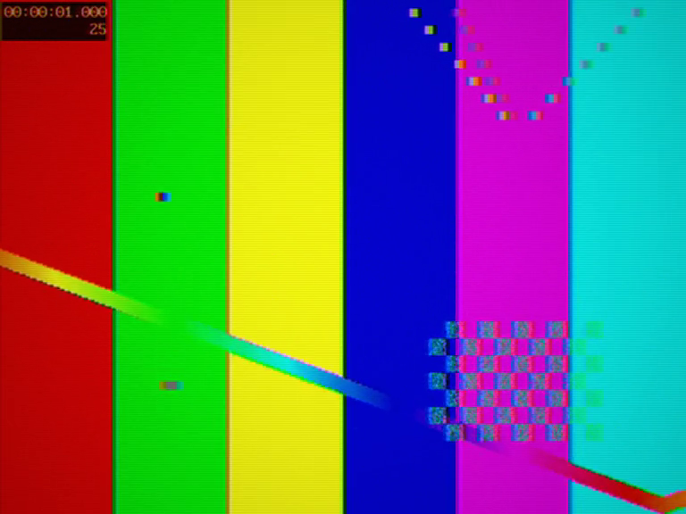

# Generic composite DVD player

Late-90s budget deck out through composite: edge ringing on the MPEG-2
decode, rare block dropouts, and the composite encode smearing luma and
chroma into each other, with hum riding the audio path. The $50 experience.

Pressed disc (Sony):

