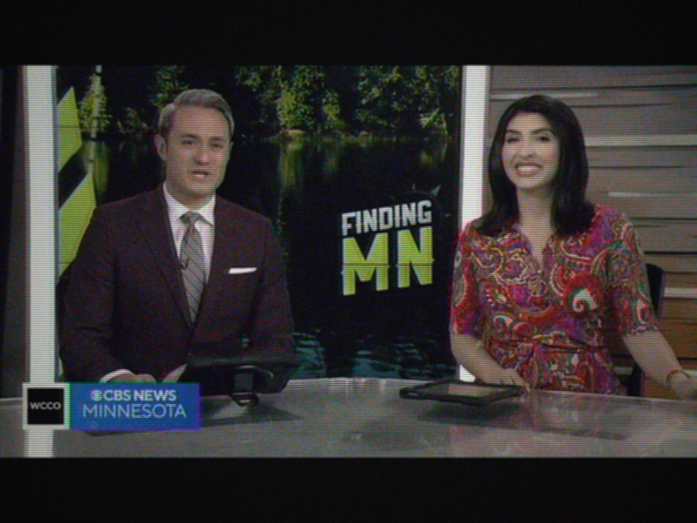

# Moderate signal (color)

Noisy/drifting reception, color retained but unstable: luma ghost
(`geq` 0.9/0.1, 6px shift), heavy chromatic snow `c0s=20 c1s=45 c2s=45`
- the chroma planes carry more noise than luma, so the color field
sparkles while the picture detail survives. Chroma drift
`cbh=2/crh=-2`, audio narrowed to 110-5500 Hz with AGC overload.

Clear reference:

GoldStar:

Gorizont:

Photon:

