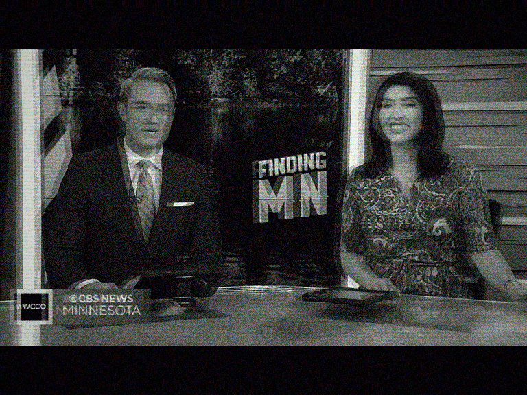
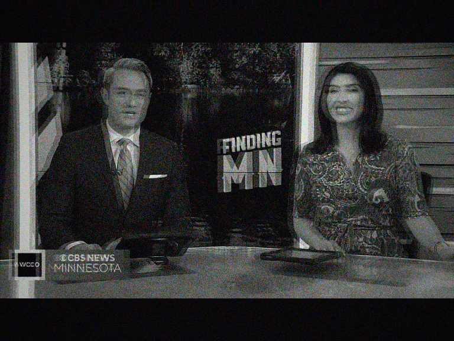
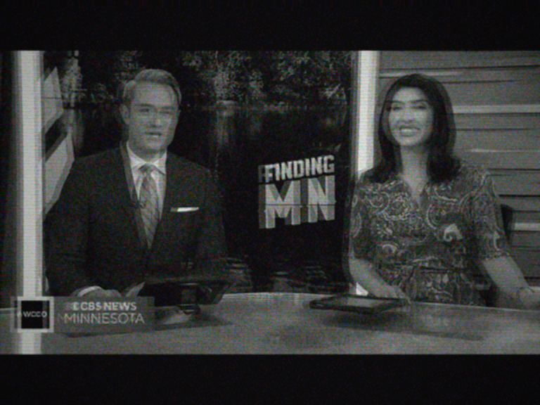

# Weak signal (B/W)

Weak reception forced to black-and-white: `hue=s=0`, strong luma ghost
(`geq` 0.7/0.3, 10px shift), heaviest snow of the range
`c0s=45 c1s=50 c2s=50`, hard chroma drift `cbh=3/crh=3/cbv=3/crv=4`,
audio narrowed to 150-3500 Hz with heavy AGC overload.

Clear reference:

GoldStar:

Gorizont:

Photon:

