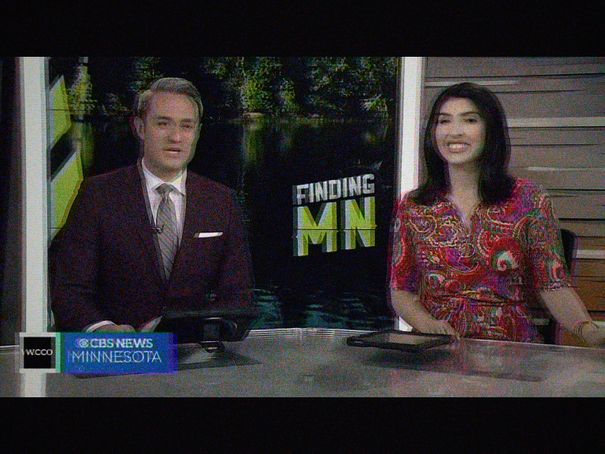
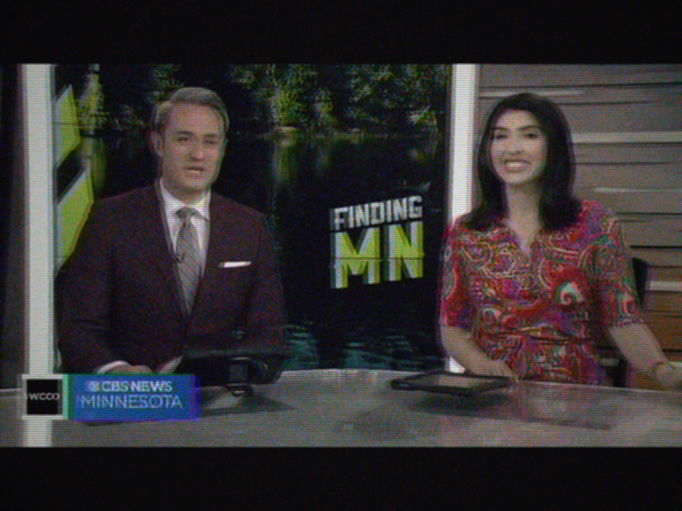

# Weak signal (color)

Weak reception, color retained but barely: strong luma ghost
(`geq` 0.7/0.3, 6px shift), heaviest chromatic snow of the range
`c0s=30 c1s=45 c2s=45` - chroma planes carry more noise than luma,
hard chroma drift `cbh=3/crh=-3/cbv=1/crv=-1`, audio narrowed to
120-3500 Hz with heavy AGC overload.

Clear reference:

GoldStar:

Gorizont:

Photon:

