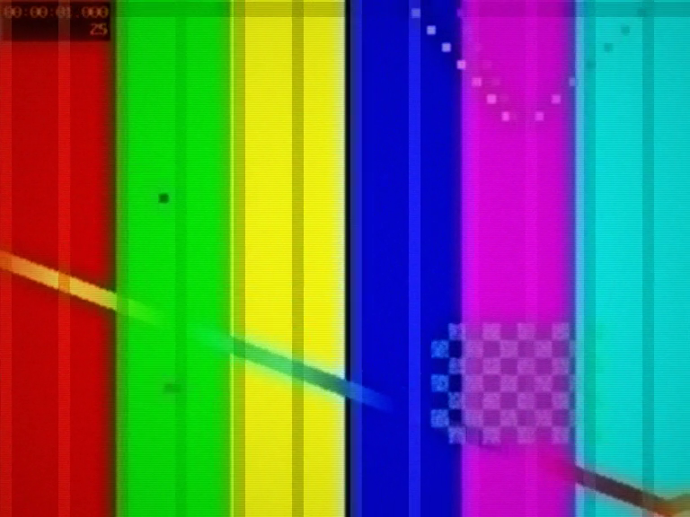
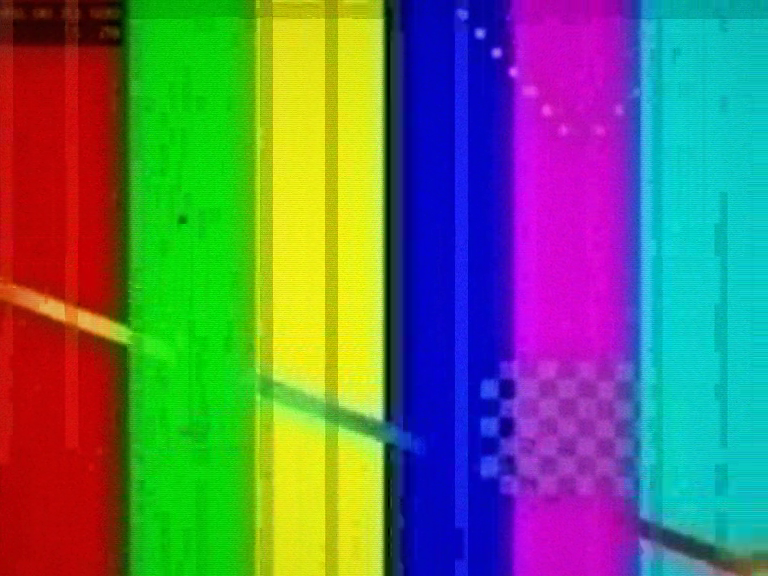
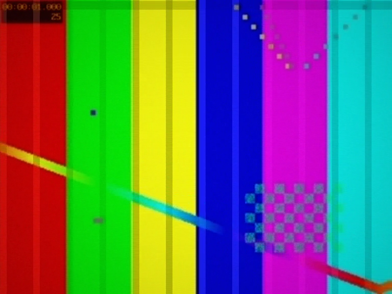

# Budget Funai deck

Third-tier mechanism, the lent-a-deck: drifting video heads, no time-base
correction, tracking that wanders, dropout chatter on the head-switch band,
FM noise riding old heads. Mono audio on a loud hiss bed.

Commercial TDK E-180, Sony:

Commercial AGFA E-180:

Commercial TDK HD-X E-180:

