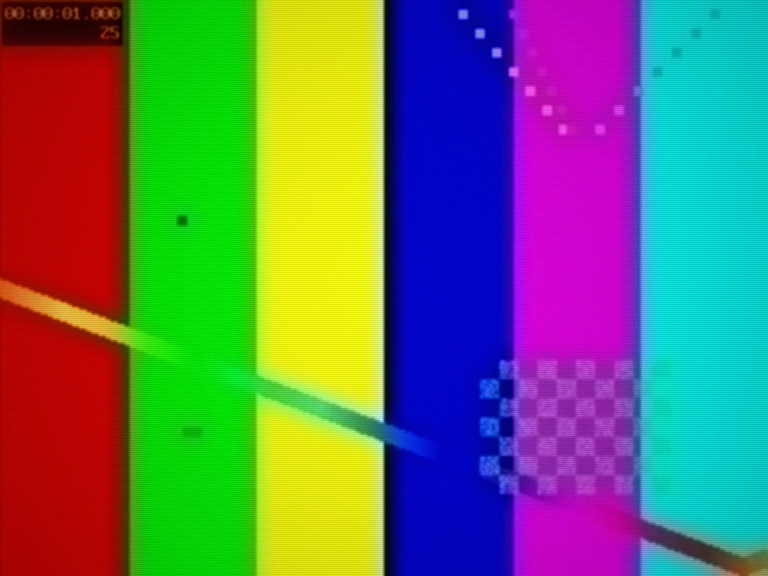
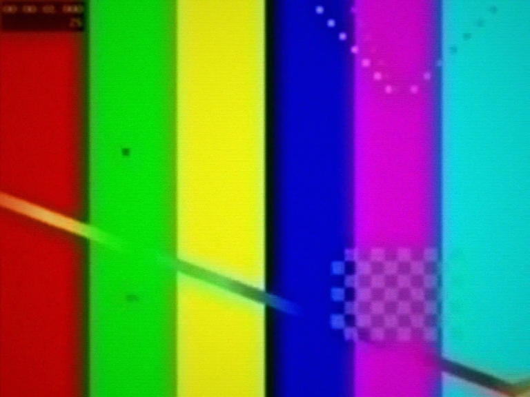

# JVC HR-S7600 deck

Hi-end VCR with a full frame TBC: transport steady, tracking locked, dropout
concealed. The denoise is the only cleanup in the set — the TBC subtracts
transport errors instead of adding picture. Audio holds the cassette's own
floor.

Commercial TDK E-180:

Commercial AGFA E-180:

Commercial TDK HD-X E-180:

